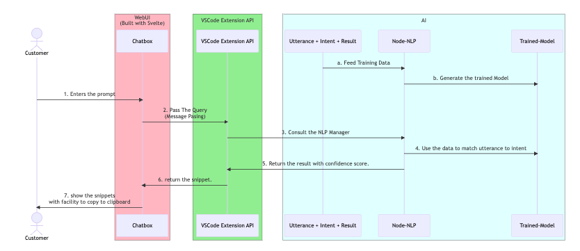

# 🚀 LRBuddy 🚀: Integrate LoginRadius in Your application 

## How LRBuddy helps you
- LRBuddy is an AI chatbot integrated into VSCode.
- Inside VSCode you give a prompt to the chatbot and the chatbot generates code snippets
- You can copy the snippets, modify few things if required like adding the apikey etc. and add to your application.
- And your app now have Identity and Access Managment Supported by LoginRadius.

## How to Run the extension

- Install this extension from the marketplace.
- open the command palette (`Ctrl+Shift+P` or `Cmd+Shift+P` on Mac) and type `LRBuddy: chat`
- This opens a new window with a chatbox.
- Enter the prompt to get code snippet like `Code for Forgot Password`

## Simplified Sequence Diagram

  

## Github Workflow
- Runs when code is pushed to main branch.
- The workflow 
  - Train and Generate the NLP Model.
  - Create webview from svelte.
  - Model, Webview is packaged with Extension backend.
  - It is published on VSCode Marketplace with patch version update scheme (0.0.9 -> 0,0.10)

## Contributing

See [the contributing guidelines](./contributing.md) for detailed instructions.

## License

The code is licensed under [MIT License](./LICENSE.txt)

## FAQ
- ***How to test locally?*** Refer [setup docs](./setup.md)
- ***How to clear chat?*** Type `clear` in chatbox and press `Enter`.
- ***DO I need to pay to try this?*** It is completely free and open source.

